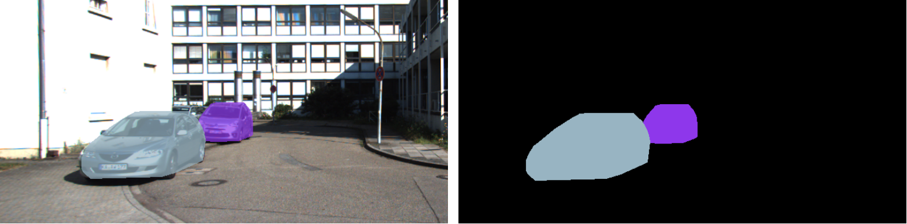

# Seg-Aug
**Semantic augmentation for Multimodal 3D Object Detection**

> - All code will be released upon publication of the paper.

### AP on KITTI testing Dataset

[Submission link](http://www.cvlibs.net/datasets/kitti/eval_object_detail.php?&result=db8a52d6e325bc9ee3788a5610ba73fc9a1c1caa)


### Segmentation labels for KITTI 3D training set (Car)

**Data Format Description**

```
annotation/
    training/
        - sem_label_car/ contains the segmentation labels (car class) for left color camera images (png)
        255: car; 
        0: background
```



